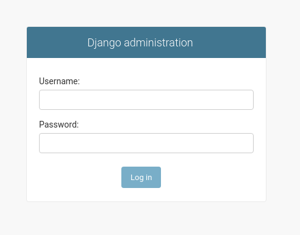
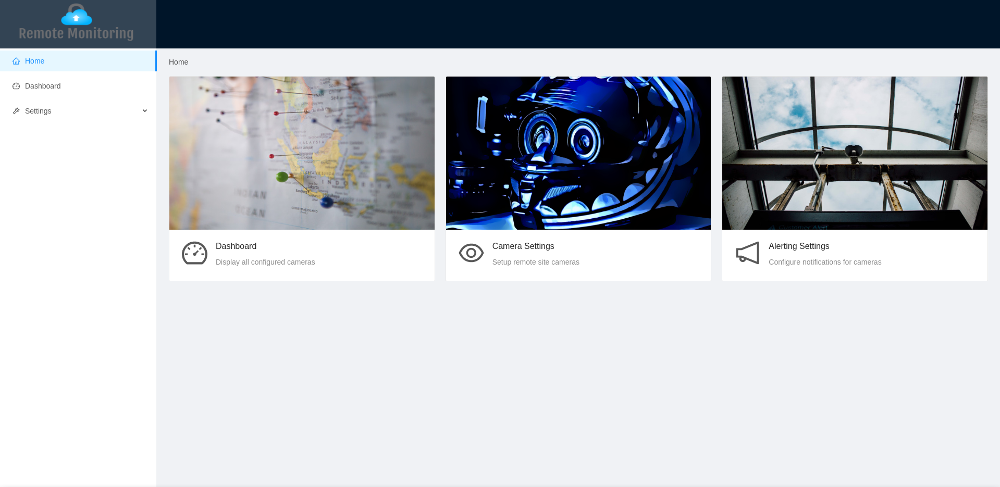
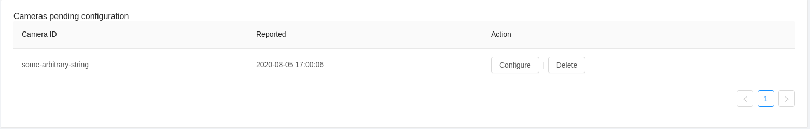
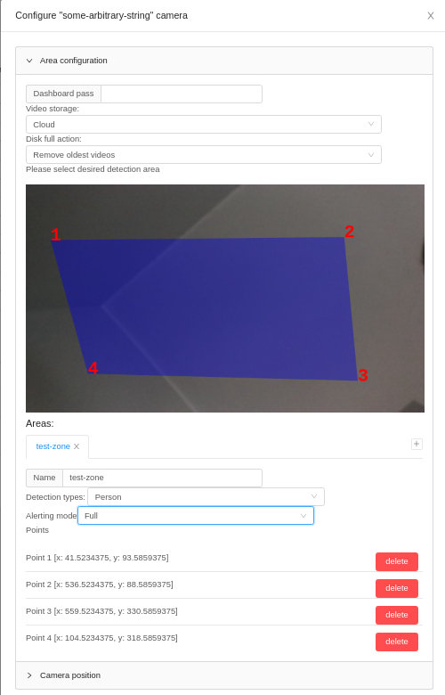
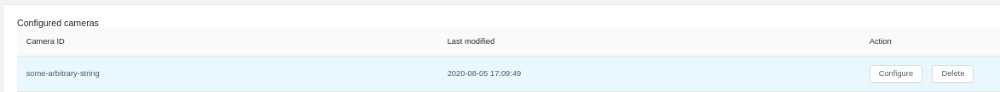

# Remote monitoring


Application that allows user to report an incident when a person or a car will be detected in
specified zone.

Supports __video recording__, __storage optimalizations__ (rolling recordings, AWS integration),
__complete logging mechanism__ (supporting concurrency, rolling logs, complete run logs) and
__alerting groups__ to specify whom to notify in case of incident, defined per-camera or per-zone

Application consists of:
- Central node (`api`)
- Camera nodes (`camera`) with optional on-device status dashboard (`onboard-app`)
- Web client (`web`)


## First-time config

To use the app properly, you need to setup the S3 bucket on Amazon (or on any Amazon-like service, like [minio](https://min.io/))
in `camera/src/config.py`

```diff
-AWS_SERVER_PUBLIC_KEY = None
-AWS_SERVER_SECRET_KEY = None
-AWS_SERVER_BUCKET_NAME = None
+AWS_SERVER_PUBLIC_KEY = 'myAWSpublicKEYishere'
+AWS_SERVER_SECRET_KEY = 'myAWSaccountSECRETkeyWHICHcanBEgenerated'
+AWS_SERVER_BUCKET_NAME = 'my-aws-bucket-name'
```

Then, for the email notifications to work, change login and password for GMail account in `api/config/settings.py`

```diff
-EMAIL_HOST_USER = None
-EMAIL_HOST_PASSWORD = None
+EMAIL_HOST_USER = 'myaccount@gmail.com'
+EMAIL_HOST_PASSWORD = 'SuperSecret!'
```

## Running central node (API)

The API needs to connect to the database (tested using PostgreSQL). Easiest way to setup the database is to do the following

```
docker-compose up -d db
export DB_HOST=localhost
export DB_NAME=remotemonitoring
```

If you use other database, you can modify the Django config using variables: `DB_NAME`, `DB_USER`, `DB_PASS`, `DB_HOST`, `DB_PORT`.

If the database it setup, go ahead and install the requirements:

```
python3 -m pip install -r requirements.txt
```

Then, we need to propagate the database with required table structures and, optionally, a default user with credentials `admin / luxonis`

```
python3 manage.py migrate
python3 manage.py loaddata fixtures/*.json
```

Finally, we run the API itself using

```
python3 manage.py runserver 0.0.0.0:8000
```

To verify, visit [http://localhost:8000/admin](http://localhost:8000/admin), you should see the following login page to access admin panel



If you used `loaddata` command, you can go ahead and login using `admin / luxonis` credentials. If not, run `python3 manage.py createsuperuser` and follow
the instructions to create an admin user

## Running the web client

Web client requires the API to be running, so be sure to follow the instructions in previous step to set it up.

Application is configured, by default, to look for the API at `http://localhost:8000`, but if you need to change this, modify `web/src/setupProxy.js`

In order to run the client, you need two commands:

```
yarn
yarn start
```

After running these, your browser should open at [localhost:3000](http://localhost:3000) and you should see the following:



## Running the camera code

To run the camera code, you need to set some of the environment variables first:

```
cd <project_root>/camera
export API_URL=http://localhost:8000  # allows the camera to know where is the central node
export DEVICE_ID=some-arbitrary-string  # used by the camera as it's ID using which it will be represented on the dashboard
export PYTHONPATH=$PYTHONPATH:$PWD  # for correct path resolution 
```

Now, we need to install the required dependencies by running

```
python3 -m pip install -r requirements.txt
```

Finally, we still need to configure our camera zones. For this, run

```
python3 src/main.py
```

You should see the following error being thrown:

```
RuntimeError: No config is present for camera_id "some-arbitrary-string"
```

This means that we're good to go with our first configuration. Open up [web interface](http://localhost:3000) and go to "Camera settings" tab.

Next up, you should see your camera as "pending configuration"



Next, click configure and setup the first zone by clicking on the loaded image. Example configuration is shown below



Lastly, set the camera position on the map (by clicking on the map) and then hit "Ok" button.

The camera you configured should be visible under "Configured cameras section"



Now, when you run the camera source code, it should come up online and parsing

```
python3 src/main.py
```

You should see now the preview window and last message from the app log saying

```
2020-08-05 17:11:08,659 - __main__ - INFO - Setup complete, parsing frames...
```
